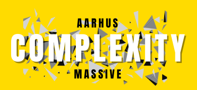

## Welcome to Aarhus University Complexity Massive

Are you interested in complexity science? Agent-based modeling? Network dynamics? Then you're in the right place!

[Sign up for our mailing list here!](https://maillist.au.dk/mailman/listinfo/aarhuscomplexitymassive.aias)

AarhusComplexityMassive is an interest group for Complexity Science. We meet every two weeks, to talk about models, discuss papers or our own research, ask for feedback, and to find new and fun ways of collaborating with each other, and colleagues across campus. 

Our next meeting is on **Tuesday November 17 10:00-11:00**. Agenda is:
* Iza Romanowska presents her work in progress on The Origins of Language. (30 minutes)
* Peter Thestrup Waade presents his thoughts on the conceptual and pragmatic overlaps between information theory and complexity science *as far as I understood!*

Due to Corona, we will meet online for the first meeting, until AIAS allows us back. Our hope is to be able to meet in person as soon as we can. Until then, please use this Zoom-link: https://aarhusuniversity.zoom.us/j/4024649019

Cheers,
[Iza](https://aias.au.dk/aias-fellows/iza-romanowska/) & [Arthur](https://pure.au.dk/portal/da/persons/hermes-arthur-hjorth(b6da5c3f-dc2f-4376-a964-cec167d512e6).html)

-- Old stuff: --

Our inaugural meeting is on **Wednesday Nov 4th 15:30-16:30**. The second meeting will be on **Tuesday Nov 17th at 10:00-11:00**.

The agenda for the first meeting is relatively open: We wil do introductions, discuss hopes and plans for the group, and set up presentations etc. for the next few meetings.

